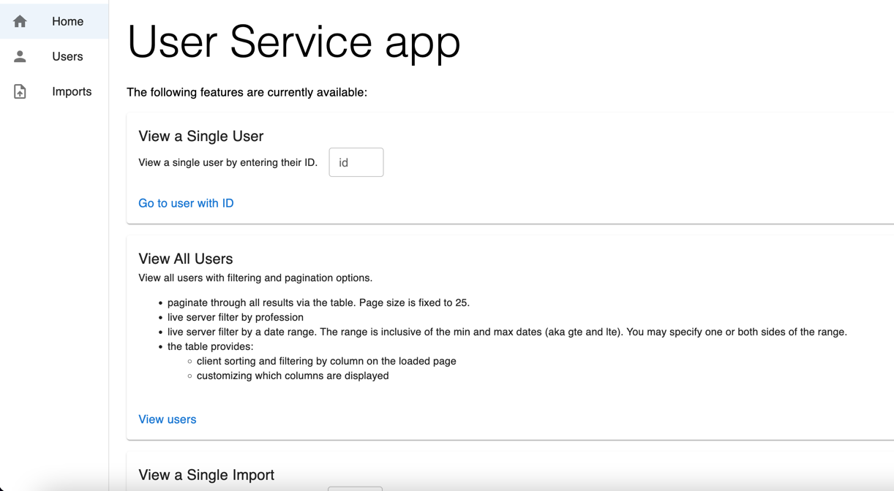

# User Service
This is a service that maintains users. It exposes both a React UI and APIs for interacting with the users and imports.
It also provides helper tools for Importing users from a CSV as well as a tool to generate a new CSV with faked data.



# API
* Response `dates` are returned in `iso8601` format for the `UTC` timezone. They include the time component,
even if the time was just set to midnight for values that only specified a date component.

* `email` values are downcased on ingestion/save into the system.

* Note: The API uses `date_created` and `date_updated` but those are `created_at` and `updated_at` respectively on 
the User model and users db table.

## GET `/api/users/:id`
Returns `200` with the given User in the payload
```
{
  "id": 200,
  "first_name": "Courtnay",
  "last_name": "Goldina",
  "email": "courtnay.goldina@gmail.com",
  "profession": "firefighter",
  "country": "Greece",
  "city": "Santo Domingo",
  "date_created": "2022-01-04T00:00:00Z",
  "date_updated": "2024-08-06T13:37:41Z",
  "import_id": 1
}
```
Returns `404` with the payload
```
{
    "error": "No record found!"
}
```

## GET `/api/users`
Returns `200` with all Users sorted by created_date in `:asc` order by default.

### Result schema
<details>
<summary>see details</summary>

#### Overview
```
{
    "data": [userOne, userTwo, ...],
    "metadata": {
        "paging": {},
        "filters": {},
        "sort": {}
    }
}
```

#### Real Example Response
GET `/api/users?date_created[gte]=2020-01-01&date_created[lt]=2024-03-01&sort_order=desc&page_limit=2&page=2&profession=doctor`
```
{
  "data": [
    {
      "id": 104,
      "first_name": "Lanae",
      "last_name": "Salvidor",
      "email": "lanae.salvidor@gmail.com",
      "profession": "doctor",
      "country": "Greenland",
      "city": "Banjul",
      "date_created": "2022-07-18T00:00:00Z",
      "date_updated": "2024-08-06T13:37:40Z",
      "import_id": 1
    },
    {
      "id": 910,
      "first_name": "Gwyneth",
      "last_name": "Yerkovich",
      "email": "gwyneth.yerkovich@gmail.com",
      "profession": "doctor",
      "country": "Belize",
      "city": "Majuro",
      "date_created": "2022-07-13T00:00:00Z",
      "date_updated": "2024-08-06T13:37:49Z",
      "import_id": null
    }
  ],
  "metadata": {
    "paging": {
      "page": 2,
      "prev": 1,
      "next": 3,
      "last": 96,
      "count": 192,
      "pages": 96,
      "limit": 2
    },
    "filters": {
      "profession": {
        "value": "doctor",
        "operator": "eq"
      },
      "date_created[gte]": {
        "value": "2020-01-01",
        "operator": "gte"
      },
      "date_created[lt]": {
        "value": "2024-03-01",
        "operator": "lt"
      }
    },
    "sort": {
      "date_created": "desc"
    }
  }
}
```

#### paging
Will always be included even if there are no results

* `page`: what page you are on
* `prev`: last page, can be null
* `next`: next page, can be null
* `last`: the last page for the results, can be 1
* `count`: the total count of records found that can be paginated through
* `pages`: the total count of pages with records you can go through
* `limit`: how many records there are per page
```
"paging": {
  "page": 2,
  "prev": 1,
  "next": 3,
  "last": 96,
  "count": 192,
  "pages": 96,
  "limit": 2
}
```
#### filters
Will be empty `{}` if there were no applied filters. Includes a key for each distinct filter+operator, 
so that means date range operations will be tracked with a separate key for each like `field[operator]`. 

* `key`: either the `field` or `field[operator]` that the filter is being applied to
* `value`: the value being compared to
* `operator`: how the records in the db are compared to the specified value, supports `[eq, in, gt, gte, lte, gt, lt]`
```
"filters": {
  "profession": {
    "value": "doctor",
    "operator": "eq"
  },
  "date_created[gte]": {
    "value": "2020-01-01",
    "operator": "gte"
  },
  "date_created[lt]": {
    "value": "2024-03-01",
    "operator": "lt"
  },
  "import_id": {
    "value": 1,
    "operator": "eq"
  }
},
```
#### sort
Will always be included even if no sort param is specified. Defaults to `:asc`
* `key`: what field was sorted by
* `value`: what the sort order was, `[asc, desc]`
```
"sort": {
  "date_created": "desc"
}
```
</details>

### Query params can specify:
* Filtering by profession, date_created, and/or import_id
* Sorting direction (though it will always sort by created_date)
* Pagination detail for what page you want and what page size you want, defaults to `25` records per page.

Filtering by `date_created`
* uses the date format `YYYY-MM-DD`
* can have multiple operations applied using `[gt, gte, lt, lte]` 
(greater than, greater than or equal, etc...) 
i.e. `api/users?date_created[gte]=2020-01-01&date_created[lt]=2020-03-01`
* can provide a single value for exact date match, i.e. `api/users?date_created=2020-01-01`

## GET `/api/imports/:id`
Returns `200` with the given Import in the payload

* status: can be one of `[:init, :error, :done]`

```
{
  "id": 1,
  "filename": "custom_file.csv",
  "record_count": 2,
  "status": "done",
  "performed_at": "2024-08-12T17:13:38Z"
}
```
Returns `404` with the payload
```
{
    "error": "No record found!"
}
```

## GET `/api/imports`
Returns `200` with all Users sorted by id in `:asc` order by default.

### Result schema
<details>
<summary>see details</summary>

#### Overview
```
{
"data": [importOne, importTwo, ...],
"metadata": {
  "paging": {},
  "filters": {},
  "sort": {}
}
}
```

#### Real Example Response
GET `http://localhost:3000/api/imports?filename=custom_file.csv&status=done&page_limit=2`
```
{
  "data": [
    {
      "id": 1,
      "filename": "custom_file.csv",
      "record_count": 2,
      "status": "done",
      "performed_at": "2024-08-12T17:13:38Z"
    },
    {
      "id": 7,
      "filename": "custom_file.csv",
      "record_count": 2,
      "status": "done",
      "performed_at": "2024-08-12T17:22:07Z"
    }
  ],
  "metadata": {
    "paging": {
      "page": 1,
      "prev": null,
      "next": 2,
      "last": 7,
      "count": 14,
      "pages": 7,
      "limit": 2
    },
    "filters": {
      "filename": {
        "value": "custom_file.csv",
        "operator": "eq"
      },
      "status": {
        "value": "done",
        "operator": "eq"
      }
    },
    "sort": {
      "id": "asc"
    }
  }
}
```

#### paging
Will always be included even if there are no results

See /users Paging section above for more details.

#### filters
Will be empty `{}` if there were no applied filters. Includes a key for each distinct filter+operator, 
so that means date range operations will be tracked with a separate key for each like `field[operator]`. 

* `key`: either the `field` or `field[operator]` that the filter is being applied to
* `value`: the value being compared to
* `operator`: how the records in the db are compared to the specified value, supports `[eq, in, gt, gte, lte, gt, lt]`
```
"filters": {
  "filename": {
    "value": "custom_file.csv",
    "operator": "eq"
  },
  "status": {
    "value": "done",
    "operator": "eq"
  }
},
```
#### sort
Will always be included even if no sort param is specified. Defaults to `:asc`
* `key`: what field was sorted by
* `value`: what the sort order was, `[asc, desc]`
```
"sort": {
  "date_created": "desc"
}
```
</details>

### Query params can specify:
* Filtering by filename, performed_at, and/or status
* Sorting direction (though it will always sort by id)
* Pagination detail for what page you want and what page size you want, defaults to `25` records per page.

Filtering by `performed_at`
* uses the date format `YYYY-MM-DD`
* can have multiple operations applied using `[gt, gte, lt, lte]` 
(greater than, greater than or equal, etc...) 
i.e. `api/imports?date_created[gte]=2020-01-01&date_created[lt]=2020-03-01`
* can provide a single value for exact date match, i.e. `api/imports?date_created=2020-01-01`


## POST `/api/imports`


# CSV Tools
This app provides 2 tools that can be run inside a `rails console` for ingesting users from a csv file and for 
generating a csv file with faked user data

<details>

## Importer
See `importer.rb`. Will import users from a CSV with the header ordered as
`[id, firstName, lastName, email, profession, createdDate, country, city]`. The order is not configurable.

```
# open a rails console from the root app directory in your system
bundle exec rails console

# inside console
Importer.import_from("csv_file_path")
```

## CsvUserDataGenerator
See `csv_user_data_generator.rb`. Will generate users into a CSV
Header order is fixed to `[id, firstName, lastName, email, profession, createdDate, country, city]`.

You can optionally configure the following arguments
* `size`: how many records you want generated. default is `5`
* `file_name`: file name of the csv that will be created/updated in the root repo directory. default is `users.csv`
* `start_id_offset`: id to start incrementing off of (by 1).
  Helpful if you want to bulk add users into a system that already has users defined. default is `1`

```
# open a rails console from the root app directory in your system
bundle exec rails console

# inside console
# with defaults
CsvUserDataGenerator.generate_csv()

# with overides
CsvUserDataGenerator.generate_csv(size: 10, file_name: "custom_file.csv", start_id_offset: 23)
```
</details>

<hr class="solid">


# Tools
These are defined in the [asdf](https://asdf-vm.com/) `.tool-versions` file. Asdf is a tool that allows for 
multiple versions of a given tool (coding language in our case) to be used on a single machine. It is not required. 
- Ruby: 3.3.1
- Nodejs: 22.5.1


# Setup
## install dependencies
```
bundle install

npm install
```

## create the database
```
rails db:create
rails db:migrate
```

# Run tests
```
bundle exec rspec
```

# Run local
## run yourself
You must have postgres exposed at post 5432 with a user:postgres, password:password
<p>
note: you can run just the db via docker-compose by running docker-compose up db
</p>
You must ensure your local ENV sets the following properties
* EXECJS_RUNTIME=Node
* DATABASE_HOST=localhost
* DATABASE_USER=postgres
* DATABASE_PASSWORD=password

### run the api/web host server

```
bundle exec rails s -p 3000
```

### run the vite dev server
this does hot loading of React changes for your localhost app
```
bin/vite dev
```

## run with docker-compose
You can run vite, rails, and postgress, in a dev env, by using the provided docker-compose setup.

```
  docker-compose up --build
```